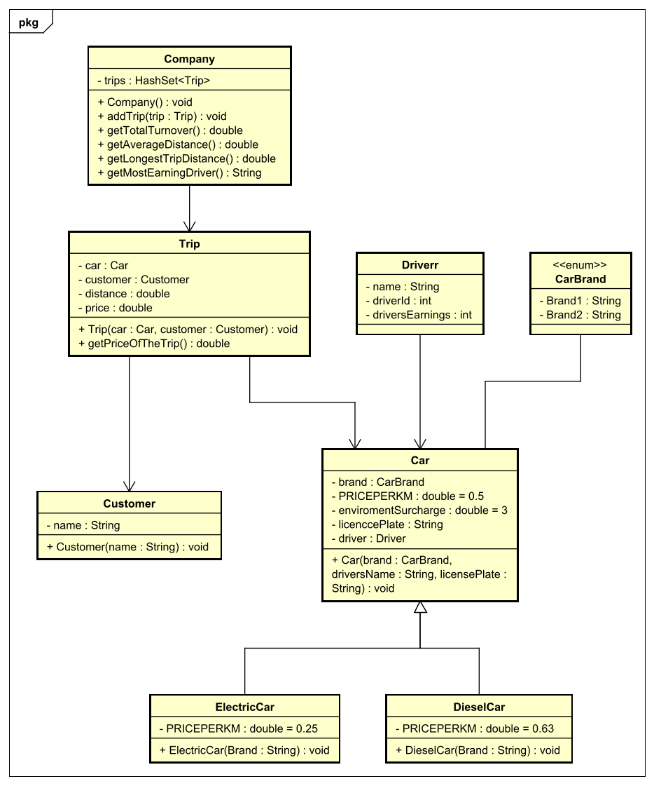

# Start Document for Car(e)

Start document by **Tadas Simanauskas**. Student number: **4855388**.

## Problem Description

The company Car(e) makes it possible to request a car via an App and to drive to a destination. Based on the current location and the destination and the type of car, an amount is calculated that the customer has to pay. There are different types of cars that can be reserved. Each car has a permanent driver who has a name and a Dutch licence plate. Two brands of cars are used. Ordinary car: price per km 50 cents. Electric car: price per km 25 cents. Diesel: price per km: 63 ct. Plus environmental surcharge of 3 euros per 10 km. For each trip, the amount must be calculated, Car(e) must also know the total turnover, the average distance and the longest trip distance and the driver with the most turnover.

This section will describe the inputs and outputs of Car(e)

#### INPUTS

| Case         | Type       | Conditions   |
| ------------ | ---------- | ------------ |
| brand        | `CarBrand` | not empty    |
| driversName  | `String`   | not empty    |
| licensePlate | `int`      | not empty    |
| name         | `String`   | not empty    |
| distance     | `double`   | not negative |
| car          | `Car`      | not empty    |
| customer     | `Customer` | not empty    |

#### OUTPUTS

| Case                          | Type     |
| ----------------------------- | -------- |
| get price of the trips        | `double` |
| get total turnover            | `double` |
| get average distance traveled | `double` |
| get longest trip distance     | `double` |
| get most earning driver       | `int`    |

Remarks

* All print lines or system outs will be done in the main class

## Class Diagram

## Test Data

in the following table you'll find all the data that is needed for testing.

### Driver

| ID   | Input                    | Code                     |
| ---- | ------------------------ | ------------------------ |
| `d1` | name: John, driverId: 1  | `new Driver("John", 1)`  |
| `d2` | name: Jim, driverId: 2   | `new Driver("Jim", 2)`   |
| `d3` | name: Tom, driverId: 3   | `new Driver("Tom", 3)`   |
| `d4` | name: Tim, driverId: 4   | `new Driver("Tim", 4)`   |
| `d5` | name: Felix, driverId: 5 | `new Driver("Felix", 5)` |
| `d6` | name: Grey, driverId: 6  | `new Driver("Grey", 6)`  |

### Car

| ID     | Input                                           | Code                                     |
| ------ | ----------------------------------------------- | ---------------------------------------- |
| `car1` | brand: Brand1, driver: d1, licensePlate: NL01AB | `new Car(CarBrand.Brand1, d1, "NL01AB")` |
| `car2` | brand: Brand2, driver: d2, licensePlate: NL02AB | `new Car(CarBrand.Brand2, d2, "NL02AB")` |

### Diesel car

| ID           | Input                                           | Code                                           |
| ------------ | ----------------------------------------------- | ---------------------------------------------- |
| `dieselCar1` | brand: Brand1, driver: d3, licensePlate: NL03AB | `new DieselCar(CarBrand.Brand1, d3, "NL03AB")` |
| `dieselCar2` | brand: Brand2, driver: d4, licensePlate: NL04AB | `new DieselCar(CarBrand.Brand2, d4, "NL04AB")` |

### Electric car

| ID             | Input                                           | Code                                             |
| -------------- | ----------------------------------------------- | ------------------------------------------------ |
| `electricCar1` | brand: Brand1, driver: d5, licensePlate: NL05AB | `new ElectricCar(CarBrand.Brand1, d5, "NL05AB")` |
| `electricCar2` | brand: Brand2, driver: d6, licensePlate: NL06AB | `new ElectricCar(CarBrand.Brand2, d6, "NL06AB")` |

### Customer

| ID      | Input         | Code                    |
| ------- | ------------- | ----------------------- |
| `tadas` | name: "Tadas" | `new Customer("Tadas")` |
| `ryan`  | name: "Ryan"  | `new Customer("Ryan")`  |
| `alex`  | name: "Alex"  | `new Customer("Alex")`  |
| `steve` | name: "Steve" | `new Customer("Steve")` |

### Trip

| ID      | Input                                             | Code                                 |
| ------- | ------------------------------------------------- | ------------------------------------ |
| `trip1` | distance: 20, car: car1, customer: ryan           | `new Trip(20, car1, ryan)`           |
| `trip2` | distance: 5, car: car2, customer: alex            | `new Trip(5, car2, alex)`            |
| `trip3` | distance: 20, car: dieselCar1, customer: ryan     | `new Trip(20, dieselcar1, ryan)`     |
| `trip4` | distance: 100, car: dieselCar2, customer: steve   | `new Trip(100, dieselcar2, steve)`   |
| `trip5` | distance: 100, car: electricCar1, customer: steve | `new Trip(100, electriccar1, steve)` |
| `trip6` | distance: 200, car: electricCar2, customer: tadas | `new Trip(200, electriccar2, tadas)` |

### Company

| ID    | Input | Code            |
| ----- | ----- | --------------- |
| `co1` |       | `new Company()` |

### Add trips to company

| Trip    | Code             |
| ------- | ---------------- |
| `trip1` | `addTrip(trip1)` |
| `trip2` | `addTrip(trip2)` |
| `trip3` | `addTrip(trip3)` |
| `trip4` | `addTrip(trip4)` |
| `trip5` | `addTrip(trip5)` |
| `trip6` | `addTrip(trip6)` |

## Test Plan

In this section the testcases will be described. Every test case should be executed with the test data as starting point.

#### #1 Getting the trip price

Testing the method to get the trip price.

| Step | Input | Action              | Expected output |
| ---- | ----- | ------------------- | --------------- |
| 1    | trip1 | getPriceOfTheTrip() | 16 euro         |
| 2    | trip2 | getPriceOfTheTrip() | 2,5 euro        |
| 3    | trip3 | getPriceOfTheTrip() | 18,6 euro       |
| 4    | trip4 | getPriceOfTheTrip() | 93 euro         |
| 5    | trip5 | getPriceOfTheTrip() | 55 euro         |
| 6    | trip6 | getPriceOfTheTrip() | 110 euro        |

#### #2 Getting the total turnover

Testing the method to get the total turnover.

| Step | Input | Action             | Expected output |
| ---- | ----- | ------------------ | --------------- |
| 1    |       | getTotalTurnover() | 295,1 euro      |

#### #3 Getting the average distance

Testing the method to get the average distance.

| Step | Input | Action               | Expected output |
| ---- | ----- | -------------------- | --------------- |
| 1    |       | getAverageDistance() | 74,167 km       |

#### #4 Getting the longest trip distance

Testing the method to get the longest trip distance.

| Step | Input | Action                   | Expected output |
| ---- | ----- | ------------------------ | --------------- |
| 1    |       | getLongestTripDistance() | 200 km          |

#### #4 Getting the most earning driver

Testing the method to get the longest trip distance.

| Step | Input | Action                 | Expected output                 |
| ---- | ----- | ---------------------- | ------------------------------- |
| 1    |       | getMostEarningDriver() | The most earning driver is id 6 |